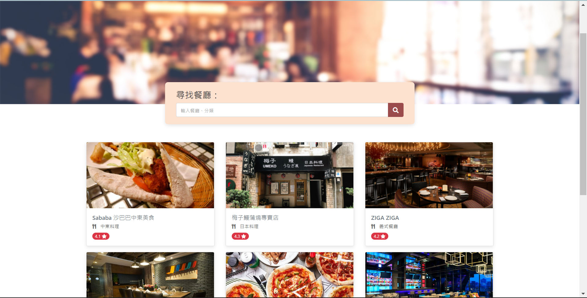

# 我的餐廳清單



## 介紹

紀錄屬於自己的餐廳清單，可以瀏覽餐廳、查看詳細資訊、甚至連結到地圖。

### 功能

- 在主頁可以查看所有餐廳的基本介紹：名稱、類型以及評分
- 搜尋欄可以搜尋特定餐廳
- 點擊餐廳就可以瀏覽更多詳細資訊：類別、地址、電話以及更多介紹
- 地址旁的小飛機可連結到 Google 地圖查看餐廳位置

## 開始使用

1. 請先確認有安裝 node.js 與 npm
2. 將專案 clone 到本地
3. 安裝 npm 、 express 、 nodemon：

   ```bash
   npm install
   npm install express@4.16.4
   npm install -g nodemon
   ```

4. 安裝完畢後，繼續輸入：

   ```bash
   nodemon app.js
   ```

5. 若看見此行訊息則代表順利運行，打開瀏覽器進入到以下網址

   ```bash
   Listening on http://localhost:3000
   ```

6. 若欲暫停使用

   ```bash
   ctrl + c
   ```

## 開發工具

- Node.js 16.14.0
- Express 4.16.4
- Express-Handlebars 3.0.0
- nodemon 2.0.16
- Bootstrap 4.3.1
- Font-awesome 5.8.1
